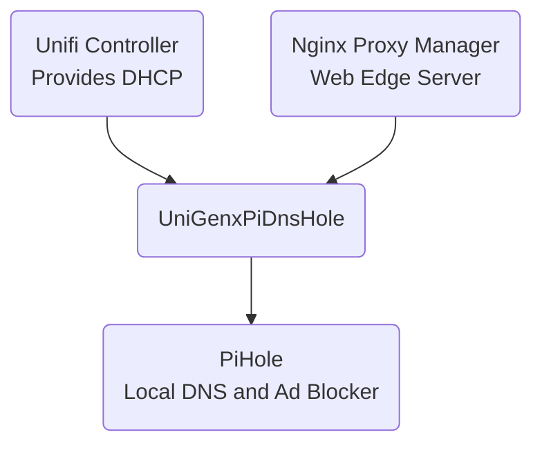

# UniGinxPiDnsHole 

Populates PiHole with custom local DNS and CNAME records based on data available from a Unifi Controller and Nginx Proxy Manager.

I am aware that this is really rather niche and I would be astounded if anyone but me ever used it.


## Concept



In my network setup devices are assigned their IP addresses by the Unifi Controller. Devices which require a fixed IP still get their IP via DHCP where possible but the IP is fixed using IP reservation on the controller. The IP is liked to the MAC address and the device is given a name. This name will become the dns entry. For example the device `Amazon Echo` will have the IP `10.0.0.10` and should have the DNS entry `amazon-echo.lan`

There is a web edge server which handles all incoming traffic on port 443. It runs Nginx Proxy Manager and routs traffic according to various rules, exposing some resources and making others only available internally. For this internal routing to work I need CNAME records mapping the external DNS enteries to a local address. For example, if the web edge was called `web-server.lan`, my domain is `awesome.com` and I want to access `files.awesome.com` I need a CNAME linking `files.awesome.com` and `web-server.lan` so that internal traffic routes correctly.

DNS on the network is handled by a redundant pair of PiHole servers. These are ad blocking DNS servers running on Raspberry Pis. For local DNS to work well and predictably I need these to serve the correct IPs for local devices. This also needs to have the CNAME enteries for routing as explained above.

Now, I could just manually enter the details into the PiHoles but where is the fun in that? I want a system which can query the two sources of truth and configure the PiHoles for me. That way when I make changes to my network or change the PiHole machine I don't need to worry about transfering or updating the configuration.

I have very little experience writing in Golang, but I am a seasoned developer in C# so I figured "What the hell, let's use Golang!"

## Building

I have included a make file for basic building and containerisation operations.
> Be sure to update the variables at the top of the make file before running it

* `make run` - Runs the app locally using go.
* `make compile` - Compiles binaries for several OS / Arch combos
    * `macos_arm64` - Apple Silicon
    * `macos_amd64` - Intel Mac
    * `linux_amd64` - Intel/AMD Linux
    * `linux_arm64` - Raspberry PI 3,4,5
    * `windows_amd64.exe` - Windows, you heathen
* `make docker` - Builds and tags the image
* `make docker-push` - Pushes the imgae to the tagged registery, assuming you are logged in
* `make docker-multiarch` - Build multi arch docker images
    * `arm64` - Raspberry PI 3,4,5
    * `amd64` - Everything else
* `make clean` - Cleans up after itself

> If you are using the `devcontainer` environment then you won't be able to run the docker commands unless you enhance the image.

## Using the app

Assuming that you know enough to download and compile the app, the configuration should not cause you any trouble. Copy `config.json.template` and rename it to `config.json`

```json
{
    "unifi": {
        "username": "your_username",
        "password": "your_password",
        "url": "https://your_controller_url",
        "site": "your_site"
    },
    "pihole": [
        {
            "name": "your_pihole_name",
            "url": "http://your_pihole_url",
            "password": "your_pihole_password"
        }
    ],
    "nginxProxyManager": {
        "url": "http://your_nginx_proxy_manager_url",
        "password": "your_nginx_proxy_manager_password",
        "username": "your_nginx_proxy_manager_username"
    },
    "domain": "your_domain",
    "webEdge": "your_web_edge",
    "local": "your_local"
}
```

Everything here should be pretty self explanitory except the last bit.
* `domain` is the fqdn you are using, for example `awesome.com`
* `webEdge` is the local dns entry for your web edge server (without a suffix), for example `web-server`
* `local` is your local lan dns suffix, such as `lan` or `local`. This will be appended to every local DNS entry
